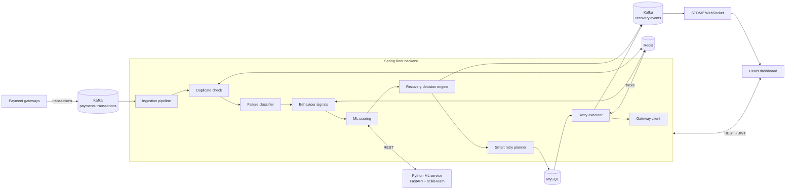

# Intelligent Payment Recovery & Risk Platform

A fintech backend that detects failed payments, predicts how likely each one is to be recovered, scores customer and transaction risk, and automatically decides the next recovery action. A real-time React dashboard lets operations teams watch recoveries happen and step in where needed.

Every year businesses lose a large share of revenue to payments that fail for fixable reasons: a customer's balance was low the day before payday, a bank was briefly down, a card expired. Blindly retrying these wastes gateway fees and can trigger fraud flags, while giving up loses the money. This platform treats each failure individually: it works out *why* the payment failed, *how likely* it is to succeed later, *whether* it looks suspicious, and *what* to do next — then does it.

---

## Features

| Feature | What it does |
|---|---|
| **Payment failure classification** | Maps gateway response codes (ISO 8583 style) and messages to a normalised reason — insufficient funds, gateway timeout, expired card, and so on — grouped into soft decline, hard decline, technical, or fraud. |
| **Recovery prediction** | A gradient-boosting model predicts the probability that each failed payment can be recovered, with an explanation of the factors that moved the score. |
| **Customer risk scoring** | A risk model scores every payment; scores are smoothed into a running risk score and band (low / medium / high) per customer. |
| **Smart retry scheduling** | Retries are timed for the best chance of success: the hours issuers approve most often, the day after the customer's salary credit, a backup gateway during bank downtime, and exponential backoff after repeated declines. |
| **Duplicate transaction detection** | Catches the same payment charged twice (same customer, amount, instrument and order within a short window) and lets an analyst refund the second charge. |
| **Fraud and anomaly detection** | Combines real-time behaviour signals (payment velocity, new devices, IP location mismatch) with an isolation-forest anomaly score. Suspicious payments are held for human review. |
| **Automated recovery workflows** | Admin-editable rules per failure category control how many retries are allowed, the wait between them, and the minimum recovery chance worth retrying. |
| **Real-time transaction events** | Every decision is published to Kafka and streamed to the dashboard over WebSocket. |
| **Admin analytics dashboard** | Shows where failed money ended up, daily trends, failure reasons, open fraud alerts, duplicate charges and upcoming retries. |

---

## Architecture



### Life of a failed payment

1. A gateway reports a transaction on the `payments.transactions` Kafka topic.
2. **Idempotency:** a transaction ID that was already processed is ignored, so Kafka redeliveries are safe.
3. **Duplicate check:** a Redis fingerprint of customer, amount, instrument and order (kept for 3 minutes) detects double charges.
4. **Classification:** the response code and message become a failure reason and category.
5. **Behaviour signals:** Redis tracks payment attempts per customer in the last 10 minutes, new devices, and logins from an unexpected city.
6. **ML scoring:** the Python service returns a recovery probability, risk score, anomaly score and the top explaining factors. If the service is unavailable, the backend falls back to rule-based scoring so processing never stops.
7. **Fraud check:** payments with a high anomaly score, unusual velocity, or a fraud decline are held for review.
8. **Recovery decision:** otherwise the workflow rule for that category decides the next step — schedule a smart retry, send a card update link, or remind the customer.
9. **Retry execution:** a scheduler picks up due retries. A per-retry Redis lock plus JPA optimistic locking ensure a customer is never charged twice, even with several backend instances.
10. **Live updates:** each decision is published to `recovery.events` after the database transaction commits, then relayed to the dashboard over WebSocket.

---

## Tech stack

| Layer | Technology |
|---|---|
| Backend | Java 21, Spring Boot 3.3 |
| Security | Spring Security, JWT access tokens (jjwt), rotating refresh tokens in Redis, role-based access (Admin / Analyst) |
| Persistence | Spring Data JPA, Hibernate, MySQL 8 |
| Cache and real-time state | Redis 7 (analytics cache, duplicate fingerprints, velocity counters, device sets, retry locks, refresh tokens) |
| Messaging | Apache Kafka 3.8 (KRaft mode) with a dead-letter topic |
| Real-time UI updates | STOMP over WebSocket |
| Machine learning | Python 3.12, FastAPI, scikit-learn (gradient boosting, logistic regression, isolation forest) |
| Frontend | React 18, Vite, React Router, Recharts, Axios |
| Deployment | Docker, Docker Compose, nginx |

---

## Project structure

```
payment-recovery-platform/
├── backend/                         Spring Boot service
│   └── src/main/java/com/prp/
│       ├── config/                  Security, Kafka, WebSocket, app properties
│       ├── security/                JWT service, auth filter, STOMP auth, refresh tokens
│       ├── domain/                  JPA entities and enums
│       ├── repository/              Spring Data repositories
│       ├── ingest/                  Kafka consumer, classifier, duplicate and fraud signals
│       ├── ml/                      Client for the Python ML service (with fallback)
│       ├── recovery/                Decision engine, retry planner, retry executor, gateway client
│       ├── events/                  Kafka event publisher and WebSocket relay
│       ├── service/                 Application services used by controllers
│       ├── web/                     REST controllers, DTOs, error handling
│       └── demo/                    First-run data and demo traffic generator
├── ml-service/                      FastAPI scoring service
│   ├── app/features.py              Feature encoding
│   ├── app/model.py                 Model training, scoring, explanations
│   ├── app/main.py                  API endpoints
│   └── tests/
├── frontend/                        React admin console
│   └── src/
│       ├── api/                     Axios client, JWT refresh, endpoint map, mock backend
│       ├── context/                 Auth, WebSocket stream, toasts
│       ├── pages/                   One file per screen
│       └── components/
└── docker-compose.yml
```

---

## Getting started

### Prerequisites

- Docker and Docker Compose

For local development without Docker you also need Java 21, Maven 3.9+, Python 3.12 and Node.js 20.

### Run the whole platform

```bash
git clone <your-repo-url>
cd payment-recovery-platform
docker compose up --build
```

| Service | URL |
|---|---|
| Dashboard | http://localhost:3000 |
| Backend API | http://localhost:8080 |
| ML service docs | http://localhost:8000/docs |

Sign in with one of the demo accounts:

| Username | Password | Role |
|---|---|---|
| `admin` | `admin123` | Can change recovery rules and run simulations |
| `analyst` | `analyst123` | Can view everything and act on payments |

On first start the backend creates these users, four default recovery rules and 14 days of sample history. It then publishes a realistic stream of gateway transactions to Kafka every 4 seconds so the dashboard stays live.

### Run services individually (development)

```bash
# 1. Infrastructure and ML service
docker compose up mysql redis kafka ml-service

# 2. Backend (http://localhost:8080)
cd backend
mvn spring-boot:run

# 3. Frontend (http://localhost:5173)
cd frontend
npm install
VITE_USE_MOCK=false npm run dev
```

The frontend can also run entirely on mock data with no backend: `VITE_USE_MOCK=true npm run dev`.

---

## Configuration

Backend settings live in `backend/src/main/resources/application.yml` and can be overridden with environment variables.

| Variable | Default | Purpose |
|---|---|---|
| `DB_HOST`, `DB_PORT`, `DB_NAME` | `localhost`, `3306`, `payment_recovery` | MySQL location |
| `DB_USER`, `DB_PASSWORD` | `prp`, `prp` | MySQL credentials |
| `REDIS_HOST`, `REDIS_PORT` | `localhost`, `6379` | Redis location |
| `KAFKA_BOOTSTRAP` | `localhost:9094` | Kafka brokers |
| `ML_URL` | `http://localhost:8000` | Python ML service |
| `JWT_SECRET` | development key | Base64 HMAC key, at least 32 bytes. **Always override outside local development.** |
| `CORS_ORIGINS` | `http://localhost:5173,http://localhost:3000` | Allowed browser origins |
| `DEMO_SEED` | `true` | Create sample history on first start |
| `DEMO_TRAFFIC` | `true` | Keep publishing demo transactions |

Business tuning (under `app:` in `application.yml`):

| Setting | Default | Meaning |
|---|---|---|
| `app.timezone` | `Asia/Kolkata` | Time zone for payday and best-hour retry timing |
| `app.fraud.anomaly-threshold` | `0.75` | Anomaly score at which a payment is held for review |
| `app.fraud.velocity-limit` | `5` | Payment attempts per customer in 10 minutes before flagging |
| `app.duplicates.window` | `3m` | How long a transaction fingerprint is remembered |
| `app.retry.poll-interval-ms` | `15000` | How often the retry executor looks for due retries |
| `app.jwt.access-ttl` / `refresh-ttl` | `15m` / `7d` | Token lifetimes |

---

## API reference

All endpoints are under `/api`, use JSON, and require `Authorization: Bearer <accessToken>` unless marked public. Errors are returned as RFC 7807 `ProblemDetail` objects with a human-readable `detail` field.

### Authentication

| Method | Endpoint | Description |
|---|---|---|
| `POST` | `/auth/login` | Public. Returns `accessToken`, `refreshToken` and the user. |
| `POST` | `/auth/refresh` | Public. Exchanges a refresh token for a new pair (the old one is invalidated). |
| `POST` | `/auth/logout` | Revokes a refresh token. |
| `GET` | `/auth/me` | Current user. |

### Analytics

| Method | Endpoint | Description |
|---|---|---|
| `GET` | `/analytics/summary?days=14` | Failed, recovered, in-progress and lost amounts; recovery rate; open alerts and upcoming retries |
| `GET` | `/analytics/trend?days=14` | Daily failed vs recovered amounts |
| `GET` | `/analytics/failure-reasons?days=14` | Count and recoveries per failure reason |

### Payments

| Method | Endpoint | Description |
|---|---|---|
| `GET` | `/payments?status=&category=&q=&sort=&page=&size=` | Paged, filterable list. `sort`: `failedAt`, `recoveryProbability` or `amount` |
| `GET` | `/payments/{id}` | Full detail: attempts, model scores and explanation, customer |
| `POST` | `/payments/{id}/retry` | Retry immediately |
| `POST` | `/payments/{id}/actions` | Body `{"action": "REQUEST_CARD_UPDATE" \| "NOTIFY_CUSTOMER" \| "ESCALATE" \| "WRITE_OFF"}` |

### Customers, retries, fraud, duplicates, rules

| Method | Endpoint | Description |
|---|---|---|
| `GET` | `/customers?riskBand=&q=&page=&size=` | Customers with risk score, failed payments, recovery rate and open balance |
| `GET` | `/retries` | Upcoming scheduled retries |
| `PATCH` | `/retries/{id}` | Reschedule: `{"scheduledAt": "2026-09-25T10:30:00Z"}` |
| `DELETE` | `/retries/{id}` | Cancel a scheduled retry |
| `GET` | `/fraud/alerts?status=OPEN` | Fraud and anomaly alerts |
| `POST` | `/fraud/alerts/{id}/resolve` | `{"decision": "CONFIRM" \| "DISMISS"}` |
| `GET` | `/duplicates?status=OPEN` | Possible duplicate charges |
| `POST` | `/duplicates/{id}/resolve` | `{"decision": "REFUND" \| "KEEP"}` |
| `GET` | `/workflows` | Recovery rules |
| `PUT` | `/workflows/{id}` | **Admin only.** Partial update of `enabled`, `maxAttempts`, `backoffHours`, `minRecoveryProbability` |
| `POST` | `/simulate/transactions?count=10&scenario=normal` | **Admin only.** Publish test transactions. Scenarios: `normal`, `duplicate`, `fraud-burst` |

### Health

`GET /actuator/health` (public) · ML service: `GET /health`

---

## Events and messaging

### Kafka topics

| Topic | Producer | Consumer | Contents |
|---|---|---|---|
| `payments.transactions` | Payment gateways (or the demo generator) | Recovery engine | Raw transactions, successful and failed |
| `payments.transactions.DLT` | Kafka error handler | You | Records that failed processing after two retries |
| `recovery.events` | Backend | WebSocket relay | Decisions made by the platform |

### Sending a transaction

```json
{
  "gatewayTxnId": "pay_Nx81Kq",
  "customerId": "CUS-1001",
  "customerName": "Diya Nair",
  "customerEmail": "diya@mail.com",
  "description": "Pro plan renewal",
  "amount": 999,
  "currency": "INR",
  "method": "CARD",
  "gateway": "Razorpay",
  "success": false,
  "responseCode": "51",
  "gatewayMessage": "Insufficient funds",
  "instrumentFingerprint": "fp-card-4417",
  "orderRef": "ORD-7781",
  "deviceId": "dev-abc",
  "ipCity": "Kozhikode",
  "occurredAt": "2026-09-23T10:15:00Z"
}
```

`method` is one of `CARD`, `UPI`, `NETBANKING`, `WALLET`.

### WebSocket

Connect with STOMP to `/ws`, sending `Authorization: Bearer <accessToken>` in the CONNECT frame, and subscribe to `/topic/transactions`. Each message looks like:

```json
{
  "eventId": "EVT-3F9A1C2B7D",
  "type": "RETRY_SUCCEEDED",
  "paymentId": "PAY-8A61D0C2E4",
  "customerName": "Diya Nair",
  "amount": 999,
  "currency": "INR",
  "reason": "INSUFFICIENT_FUNDS",
  "gateway": "Razorpay",
  "timestamp": "2026-09-23T10:31:02Z"
}
```

Event types: `PAYMENT_FAILED`, `RETRY_SCHEDULED`, `RETRY_SUCCEEDED`, `RETRY_FAILED`, `FRAUD_FLAGGED`, `DUPLICATE_BLOCKED`.

---

## Machine learning service

The ML service trains three models when it starts:

| Model | Algorithm | Output |
|---|---|---|
| Recovery | Gradient boosting classifier | Probability the payment will be recovered |
| Risk | Logistic regression | Probability the payment ends in fraud or chargeback, blended into a 0–100 risk score |
| Anomaly | Isolation forest, trained on normal behaviour | 0–1 score of how unusual the payment behaviour is |

**Features:** failure reason, payment method, amount, time of day, days since salary credit, the customer's past recovery rate, failures and tenure, customer risk score, recent velocity, new device, and IP city mismatch.

**Explanations:** for each prediction the service replaces one group of features at a time with the average customer's values and measures how much the recovery probability changes. The four biggest movers are returned as `topFactors` and shown on the payment detail screen.

**Training data:** the models currently train on a synthetic dataset generated in `ml-service/app/model.py`, designed to mimic realistic payment behaviour. To use real data, replace `synthetic_history()` with a loader for your labelled payment history.

Example request:

```bash
curl -X POST http://localhost:8000/score -H "Content-Type: application/json" -d '{
  "reasonCode": "INSUFFICIENT_FUNDS", "category": "SOFT_DECLINE", "amount": 999,
  "method": "UPI", "hourOfDay": 11, "daysSinceSalary": 2,
  "customerFailedCount": 4, "customerRecoveredCount": 3, "tenureDays": 400,
  "customerRiskScore": 20, "velocity10m": 1, "newDevice": false, "ipCityMismatch": false
}'
```

---

## Default recovery rules

| Rule | Max retries | Wait between retries | Stop below recovery chance | Steps |
|---|---|---|---|---|
| Soft declines | 4 | 24 h | 30% | Retry at the best predicted time → reminder → retry after salary credit → escalate |
| Technical failures | 3 | 1 h | 10% | Retry in 15 minutes → switch to backup gateway → retry on backup |
| Hard declines | 1 | 72 h | 15% | Send card update link → reminder after 3 days → write off after 7 days |
| Suspected fraud | 0 | — | — | Hold payment → fraud review → block customer if confirmed |

Admins can change these from the **Recovery rules** screen.

---

## Reliability and security

- **Idempotent consumption:** each gateway transaction ID is unique in the database, so Kafka redeliveries are ignored.
- **Dead-letter topic:** malformed records are retried twice and then parked on `payments.transactions.DLT` instead of blocking the partition.
- **No double charges:** each scheduled retry takes a Redis lock, and payments use JPA optimistic locking, so a scheduled retry and a manual retry cannot both succeed.
- **Consistent events:** events are published only after the database transaction commits, so the dashboard never shows a decision that was rolled back.
- **Graceful degradation:** if the ML service is slow or down, rule-based scoring takes over.
- **Stateless authentication:** short-lived JWT access tokens; refresh tokens are stored in Redis, rotated on every use, and can be revoked.
- **Role-based access:** only admins can change recovery rules or run simulations.

---

## Testing

```bash
# Backend unit tests (failure classifier, retry planner)
cd backend && mvn test

# ML service tests
cd ml-service
pip install -r requirements.txt pytest httpx
pytest
```

---

## Before going to production

- Change the seeded passwords and set a strong `JWT_SECRET`.
- Replace `ddl-auto: update` with Flyway or Liquibase migrations.
- Replace `SimulatedGatewayClient` with real gateway integrations (for example the Razorpay or PayU SDKs).
- Connect `NotificationService` to an email, SMS or WhatsApp provider.
- Train the ML models on real labelled payment history.
- Set `DEMO_SEED=false` and `DEMO_TRAFFIC=false`.

## Possible extensions

- Per-issuer learning of the best retry hour instead of fixed windows
- Model retraining pipeline with drift monitoring
- Customer self-service payment links with tracking
- Chargeback and dispute management
- Multi-tenant support for several merchants

---

## Author

**Shaik Irfan Nawaz**
B.Tech, Computer Science and Engineering (Artificial Intelligence & Machine Learning)
Mohan Babu University
